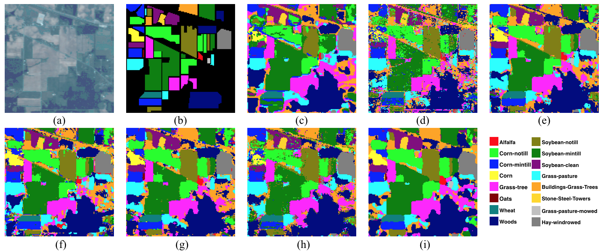
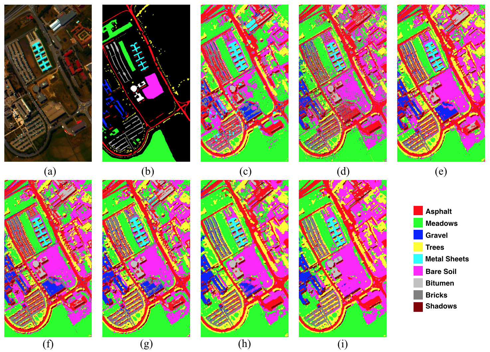

# SSRN for Hyperspectral Image Classification in Kersa

This is the keras implementation of SSRNs in the [TGRS paper](https://www.researchgate.net/publication/320145277_Spectral-spatial_residual_networks_for_hyperspectral_image_classification_a_3D_deep_learning_framework) and [IGARSS2017 paper](https://www.researchgate.net/publication/320145356_Deep_Residual_Networks_for_Hyperspectral_Image_Classification).
<br/>

```jason
Spectral-spatial residual networks for hyperspectral image classification: a 3D deep learning framework
Zilong Zhong, Jonathan Li, Zhiming Luo, Michael Chapman
IEEE Transactions on Geoscience and Remote Sensing
Article DOI: 10.1109/TGRS.2017.2755542
```

```jason
Deep Residual Networks for Hyperspectral Image Classification
Zilong Zhong, Jonathan Li, Lingfei Ma, Han Jiang, He Zhao
IGARSS 2017
```

## Descriptions
In this paper, we designed an end-to-end spectral-spatial residual network (SSRN) that takes raw 3D cubes as input data without feature engineering for hyperspectral image classification. In this network, the spectral and spatial residual blocks consecutively learn discriminative features from abundant spectral signatures and spatial contexts in hyperspectral imagery (HSI).


Fig.1  Spectral-Spatial Residual Network with a 7x7x200 input HSI volume. The network includes two spectral and two spatial residual blocks. An average pooling layer and a fully connected layer transform a 5x5x24 spectral-spatial feature volume into a 1x1xL output feature vector

The proposed SSRN is a supervised deep learning framework that alleviates the declining-accuracy phenomenon of other deep learning models. Specifically, the residual blocks connect every other 3D convolutional layer through identity mapping, which facilitates the back propagation of gradients. Furthermore, we impose batch normalization on every convolutional layer to regularize the learning process and improve the classification performance of trained models. Quantitative and qualitative results demonstrate that SSRN achieved the state-of-the-art HSI classification accuracy in different kinds of hyperspectral datasets.


## Prerequisites

- [Anaconda2.7](https://www.anaconda.com/download/#linux)
- [Tensorflow 1.3](https://github.com/tensorflow/tensorflow/tree/r1.3)

When you create a conda environment, check you have installed the packages in the [package-list](https://github.com/zilongzhong/SSRN/blob/master/package-list.txt).

## Results

### IN dataset

* Generated samples (100th epochs)



Fig.2  Classification results of different deep learning mdoels for IN datasets. (a) False color image. (b) Ground truth labels. (c) - (i) Classification results of SVM, SAE, CNN, CNNL, SPA, SPC, and SSRN}

### UP dataset

* Generated samples (100th epochs)



Fig.3  Classification results of different deep learning mdoels for IN datasets. (a) False color image. (b) Ground truth labels. (c) - (i) Classification results of SVM, SAE, CNN, CNNL, SPA, SPC, and SSRN}

## IGARSS Presentation

<a href="https://www.youtube.com/watch?v=Od1DQESmbFg&t=0s" target="_blank"></a>
