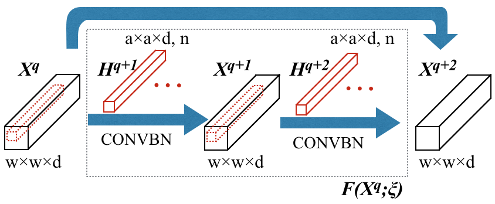
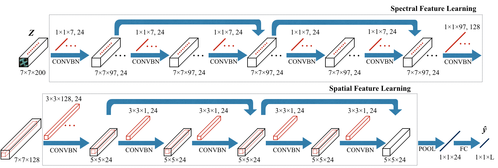
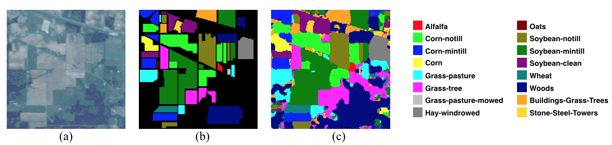
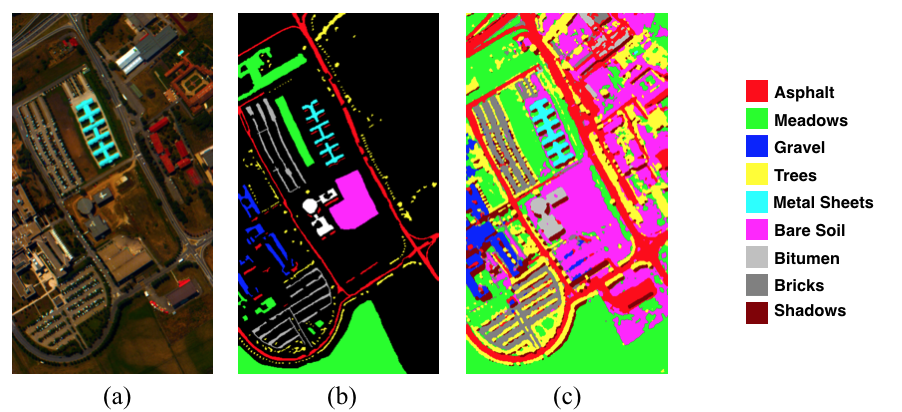

# Implementation of SSRN for Hyperspectral Image Classification

Paper links: [IEEE T-GARS paper](http://ieeexplore.ieee.org/document/8061020/) and [IGARSS2017 paper](https://www.researchgate.net/publication/320145356_Deep_Residual_Networks_for_Hyperspectral_Image_Classification).
Code download link: [SSRN code](https://github.com/zilongzhong/SSRN/archive/master.zip).

Here are the bibliography info:
<br/>

```jason
@article{zhong2018spectral,
  title={Spectral-Spatial Residual Network for Hyperspectral Image Classification: A 3-D Deep Learning Framework},
  author={Zhong, Zilong and Li, Jonathan and Luo, Zhiming and Chapman, Michael},
  journal={IEEE Transactions on Geoscience and Remote Sensing},
  volume={56},
  number={2},
  pages={847--858},
  year={2018},
  publisher={IEEE}
}
```

## Descriptions
In this paper, we designed an end-to-end spectral-spatial residual network (SSRN) that takes raw 3D cubes as input data without feature engineering for hyperspectral image classification. In this network, the spectral and spatial residual blocks consecutively learn discriminative features from abundant spectral signatures and spatial contexts in hyperspectral imagery (HSI).



Fig.1 Spectral Residual Block


Fig.2 Spatial Residual Block



Fig.3  Spectral-Spatial Residual Network with a 7x7x200 input HSI volume. The network includes two spectral and two spatial residual blocks. An average pooling layer and a fully connected layer transform a 5x5x24 spectral-spatial feature volume into a 1x1xL output feature vector

The proposed SSRN is a supervised deep learning framework that alleviates the declining-accuracy phenomenon of other deep learning models. Specifically, the residual blocks connect every other 3D convolutional layer through identity mapping, which facilitates the back propagation of gradients. Furthermore, we impose batch normalization on every convolutional layer to regularize the learning process and improve the classification performance of trained models. Quantitative and qualitative results demonstrate that SSRN achieved the state-of-the-art HSI classification accuracy in different kinds of hyperspectral datasets.


## Prerequisites

- [Anaconda 2.7](https://www.anaconda.com/download/#linux)
- [Tensorflow 1.3](https://github.com/tensorflow/tensorflow/tree/r1.3)
- [Keras 2.0](https://github.com/fchollet/keras)

When you create a conda environment, check you have installed the packages in the [package-list](https://github.com/zilongzhong/SSRN/blob/master/package-list.txt). You can also refer to the [managing environments](https://conda.io/docs/user-guide/tasks/manage-environments.html) of conda.


## Usage

Train models with commonly studied hyperspectral imagery (HSI) datasets:
```bash
$ python ./SSRN_IN.py
$ python ./SSRN_UP.py

```
Evaluate saved trained models:
```bash
$python ./Load_Models/Load_IN.py
$python ./Load_Models/Load_UP.py

```
Illustrate final classification maps:
```bash
$python ./Classification\ Maps/IN_classification_maps.py
$python ./Classification\ Maps/UP_classification_maps.py

```

If you encountered problems like " no such file or direcotry", please check the corresponding paths and change them to absolute paths.

## Results

### Indian Pines (IN) dataset



Fig.4  The IN dataset classification result (Overall Accuracy 99.44%) of SSRN using 20% samples for training. (a) False color image. (b) Ground truth labels. (c) Classification map. 

### University of Pavia (UP) dataset



Fig.5  The UP dataset classification result (Overall Accuracy 99.91%) of SSRN using 10% samples for training. (a) False color image. (b) Ground truth labels. (c) Classification map.

## IGARSS Presentation

<a href="https://www.youtube.com/watch?v=Od1DQESmbFg&t=0s" target="_blank"></a>

## Acknowledgement

Part of codes is from a wonderful implementation of ResNet by [Raghavendra Kotikalapudi](https://github.com/raghakot/keras-resnet).
